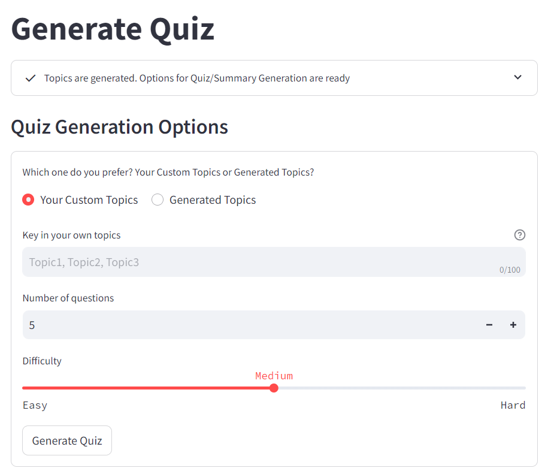
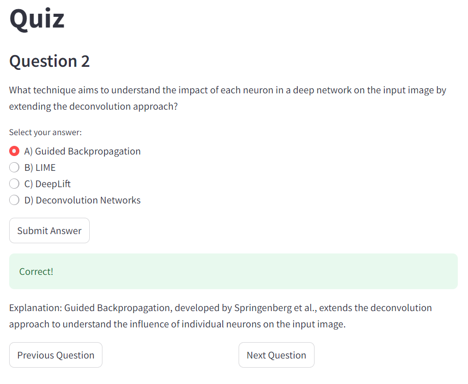
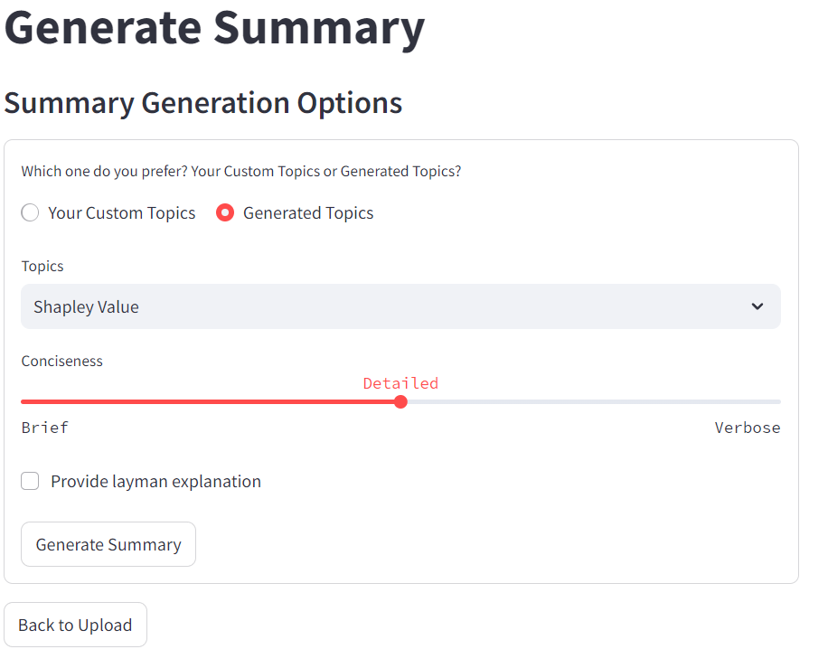
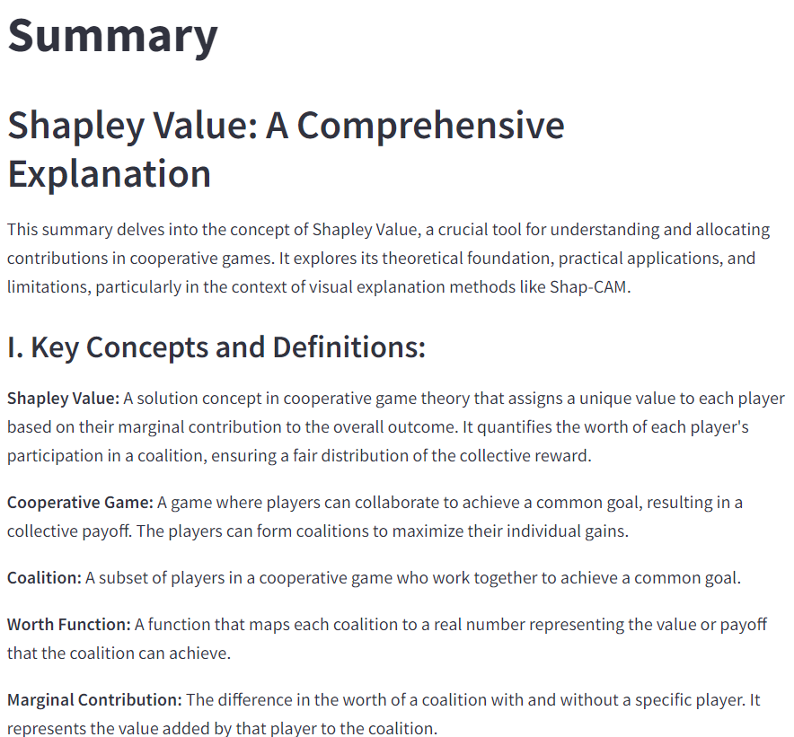

### Academic Generator Setup

This web application aims to generate quiz or summarize relevant information from the academic notes that user has uploaded. It heavily relies on GCP, Vertex AI Gemini and Pinecone. Follow the steps for a successful GCP deployment.
You can also simply set up this web application locally but you must still ensure that you have the necessary API key or service account from GCP and Pinecone.

1. Sign up for Pinecone account and retrieve the API key after logging in. Go to https://app.pinecone.io/?sessionType=signup
2. Go to https://console.cloud.google.com/iam-admin/serviceaccounts?project=<YOUR PROJECT ID> and create a service account. Copied JSON credentials
3. Ensure that the service account has the following roles: App Engine Admin, Secret Manager Admin, Cloud Run Admin, Cloud Build Service Account, Storage Admin, Service Account User, Service Usage Consumer and Vertex AI user. These roles are at the highest access so feel free to reduce the access level
4. Place the credentials and relevant information in Github Secret variables: GOOGLE_APPLICATION_CREDENTIALS, GOOGLE_SERVICE_ACCOUNT and PINECONE_API_KEY.
5. Type down your project id in Github repository variables: PROJECTID
6. Create GCP Cloud Storage Bucket for terraform state and rename the bucket name in backend.tf

#### Snapshots of Academic Generator

##### Generate Quiz Options

##### Quiz Question

##### Generate Summary Options

##### Summary
